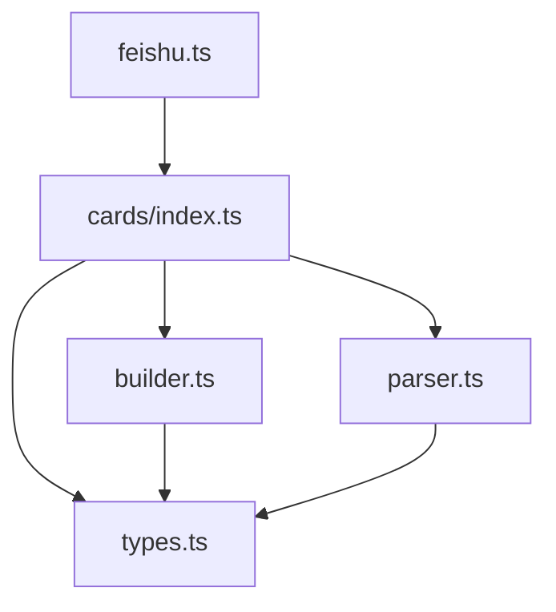
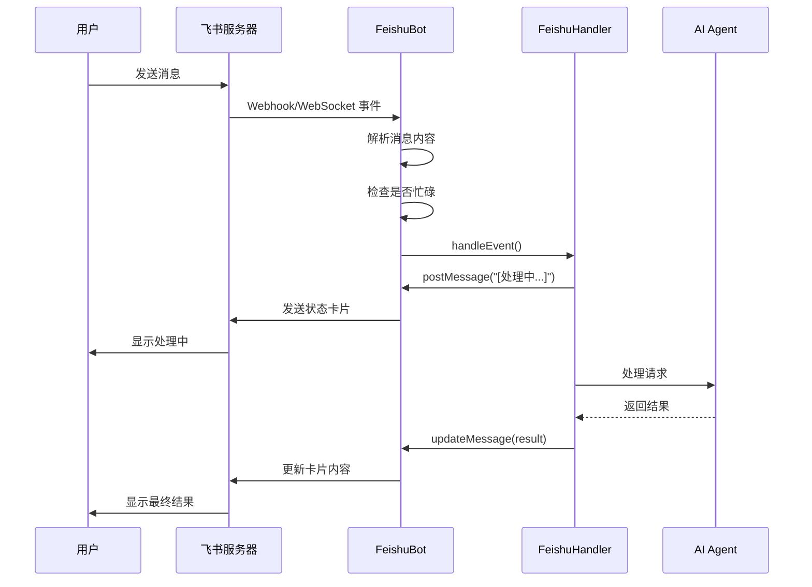
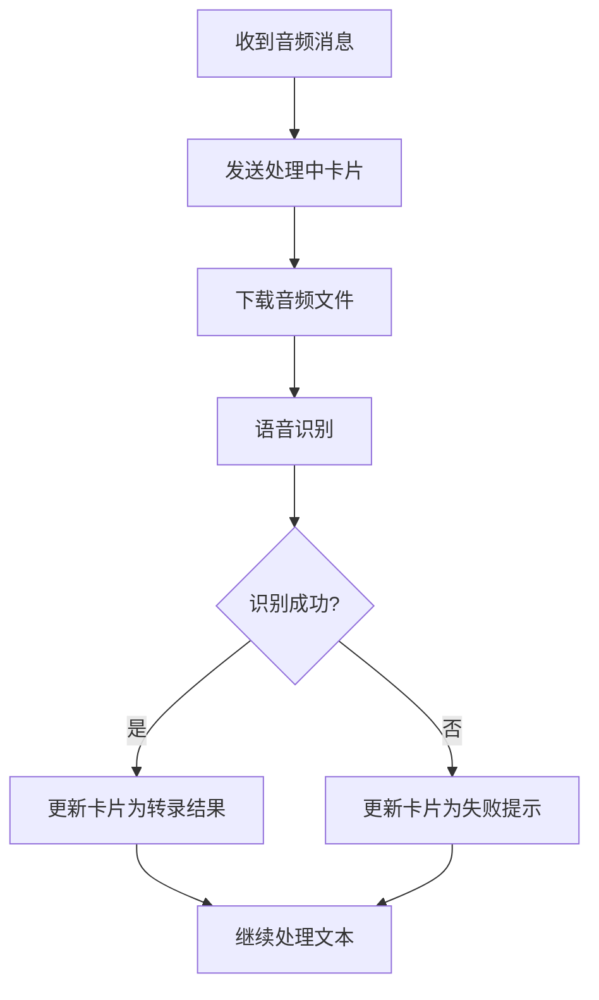

# pi-feishu 卡片 2.0 设计文档

## 1. 概述

### 设计理念

**AI 生成 markdown，卡片负责渲染**

pi-feishu 的卡片 2.0 设计遵循一个核心原则：让 AI 专注于生成结构良好的 Markdown 内容，而飞书卡片负责将这些内容美观地渲染出来。这种设计简化了 AI 的输出逻辑，同时保证了良好的用户体验。

### Schema 版本

采用飞书卡片 JSON 2.0 标准，主要特点：
- 使用 `schema: "2.0"` 标识
- 支持 `lark_md` 格式的富文本渲染
- 支持可折叠区域（`collapsible_panel`）
- 支持卡片更新（`update_multi: true`）

## 2. 架构设计

### 核心模块位置

```
pi-mono/packages/pi-feishu/src/cards/
├── index.ts      # 公共 API 导出
├── types.ts      # 类型定义
├── builder.ts    # 卡片构建函数
└── parser.ts     # 响应解析函数
```

### 模块职责

| 模块 | 职责 |
|------|------|
| `types.ts` | 定义卡片相关的 TypeScript 类型 |
| `builder.ts` | 提供构建各种卡片元素的函数 |
| `parser.ts` | 解析 AI 回复，提取结构化内容 |
| `index.ts` | 统一导出公共 API |

### 模块依赖关系



## 3. 类型定义

### CardConfig - 卡片配置

```typescript
interface CardConfig {
  width_mode?: "default" | "compact" | "fill";  // 宽度模式
  update_multi?: boolean;                        // 是否支持更新
  enable_forward?: boolean;                      // 是否允许转发
}
```

### CardHeader - 卡片标题

```typescript
interface CardHeader {
  title: { content: string; tag: "plain_text" | "lark_md" };
  subtitle?: { content: string; tag: "plain_text" | "lark_md" };
  template?: string;
  icon?: {
    tag: "standard_icon" | "custom_icon";
    token?: string;
    color?: string;
    img_key?: string;
  };
  padding?: string;
}
```

### CardBody - 卡片正文

```typescript
interface CardBody {
  elements: CardElement[];
  direction?: "vertical" | "horizontal";
  padding?: string;
  horizontal_spacing?: string;
  vertical_spacing?: string;
  horizontal_align?: "left" | "center" | "right";
  vertical_align?: "top" | "center" | "bottom";
}
```

### CardElement - 卡片元素

```typescript
interface CardElement {
  tag: string;                                    // 元素类型标签
  element_id?: string;
  text?: { content: string; tag: "plain_text" | "lark_md" };
  title?: { content: string; tag: "plain_text" | "lark_md" };
  elements?: CardElement[];                       // 嵌套元素
  header?: { title: { content: string; tag: "plain_text" | "lark_md" } };
  content?: string;
  expanded?: boolean;                             // 折叠状态
  margin?: string;
  // column_set 相关
  flex_mode?: string;
  background_style?: string;
  columns?: CardColumn[];
  // 其他属性
  [name: string]: unknown;
}
```

### CardContent - 完整卡片内容

```typescript
interface CardContent {
  schema: "2.0";
  config?: CardConfig;
  header?: CardHeader;
  body: CardBody;
  card_link?: {
    url?: string;
    android_url?: string;
    ios_url?: string;
    pc_url?: string;
  };
}
```

### ParsedResponse - 解析后的回复结构

```typescript
interface ParsedResponse {
  summary: string;                                // 内容摘要
  codeBlocks: { language: string; code: string }[];  // 代码块列表
  fileChanges: {
    type: "created" | "modified" | "deleted";
    path: string;
  }[];                                            // 文件变更列表
  details: string;                                // 原始完整内容
}
```

## 4. 卡片构建函数

### 基础函数

#### buildDivider() - 构建分割线

```typescript
function buildDivider(): CardElement {
  return { tag: "hr" };
}
```

#### buildDiv() - 构建文本 div

```typescript
function buildDiv(content: string): CardElement {
  return {
    tag: "div",
    text: { content, tag: "lark_md" },
  };
}
```

#### buildCollapsibleSection() - 构建可折叠区域

```typescript
function buildCollapsibleSection(
  title: string,
  content: string,
  collapsed = true
): CardElement {
  return {
    tag: "collapsible_panel",
    header: { title: { content: title, tag: "plain_text" } },
    expanded: !collapsed,
    elements: [{ tag: "div", text: { content, tag: "lark_md" } }],
  };
}
```

#### buildCodeBlock() - 构建代码块

```typescript
function buildCodeBlock(code: string, language?: string): CardElement {
  const langTag = language
    ? `\`\`\`${language}\n${code}\n\`\`\``
    : `\`\`\`\n${code}\n\`\`\``;
  return {
    tag: "div",
    text: { content: langTag, tag: "lark_md" },
  };
}
```

### 高级函数

#### buildTextCard() - 构建简单文本卡片

```typescript
function buildTextCard(title: string, content: string): CardContent {
  return {
    schema: "2.0",
    config: { width_mode: "fill", update_multi: true },
    header: { title: { content: title, tag: "plain_text" } },
    body: {
      elements: [
        {
          tag: "div",
          text: { content, tag: "lark_md" },
        },
      ],
    },
  };
}
```

#### buildCodeCard() - 构建代码卡片

```typescript
function buildCodeCard(
  title: string,
  code: string,
  language?: string
): CardContent {
  const langTag = language
    ? `\`\`\`${language}\n${code}\n\`\`\``
    : `\`\`\`\n${code}\n\`\`\``;
  return {
    schema: "2.0",
    config: { width_mode: "fill", update_multi: true },
    header: { title: { content: title, tag: "plain_text" } },
    body: {
      elements: [
        {
          tag: "div",
          text: { content: langTag, tag: "lark_md" },
        },
      ],
    },
  };
}
```

#### buildStructuredCard() - 构建结构化结果卡片

```typescript
function buildStructuredCard(
  title: string,
  summary: string,
  sections?: { title: string; content: string; collapsed?: boolean }[]
): CardContent {
  const elements: CardElement[] = [];

  // 添加摘要
  if (summary) {
    elements.push(buildDiv(summary));
  }

  // 添加分割线和可折叠区域
  if (sections && sections.length > 0) {
    if (summary) {
      elements.push(buildDivider());
    }
    for (const section of sections) {
      elements.push(
        buildCollapsibleSection(section.title, section.content, section.collapsed ?? true)
      );
    }
  }

  return {
    schema: "2.0",
    config: { width_mode: "fill", update_multi: true },
    header: { title: { content: title, tag: "plain_text" } },
    body: {
      elements: elements.length > 0 ? elements : [buildDiv("(无内容)")],
    },
  };
}
```

### 辅助函数

#### buildFileChangeList() - 构建文件变更列表

```typescript
const FILE_CHANGE_ICONS = {
  created: "➕",
  modified: "✏️",
  deleted: "🗑️",
};

function buildFileChangeList(
  changes: { type: "created" | "modified" | "deleted"; path: string }[]
): string {
  if (changes.length === 0) return "";
  return changes.map((c) => `${FILE_CHANGE_ICONS[c.type]} ${c.path}`).join("\n");
}
```

#### buildCodeBlocksList() - 构建代码块列表

```typescript
function buildCodeBlocksList(
  blocks: { language: string; code: string }[]
): string {
  if (blocks.length === 0) return "";
  return blocks
    .map((b) => {
      const lang = b.language || "";
      return `\`\`\`${lang}\n${b.code}\n\`\`\``;
    })
    .join("\n\n");
}
```

## 5. 响应解析器

### parseResponse() - 解析 AI 回复

```typescript
function parseResponse(text: string): ParsedResponse {
  const codeBlocks = extractCodeBlocks(text);
  const fileChanges = extractFileChanges(text);
  const summary = extractSummary(text);

  return {
    summary,
    codeBlocks,
    fileChanges,
    details: text,
  };
}
```

### extractCodeBlocks() - 提取代码块

使用正则表达式提取 Markdown 代码块：

```typescript
function extractCodeBlocks(text: string): { language: string; code: string }[] {
  const blocks: { language: string; code: string }[] = [];
  const regex = /```(\w*)\n([\s\S]*?)```/g;
  let match: RegExpExecArray | null = regex.exec(text);
  while (match !== null) {
    blocks.push({
      language: match[1] || "",
      code: match[2].trim(),
    });
    match = regex.exec(text);
  }
  return blocks;
}
```

### extractFileChanges() - 提取文件变更

识别文本中的文件操作描述：

```typescript
function extractFileChanges(
  text: string
): { type: "created" | "modified" | "deleted"; path: string }[] {
  const changes: { type: "created" | "modified" | "deleted"; path: string }[] = [];

  const patterns = [
    // "创建/新建/添加 xxx" 或 "xxx 已创建"
    { regex: /(?:创建|新建|添加|Created|New|Added?)\s+[`"]?([^\s"`]+\.[a-zA-Z]+)[`"]?/gi, type: "created" as const },
    // "修改/更新 xxx" 或 "xxx 已修改"
    { regex: /(?:修改|更新|编辑|Modified|Updated?|Edited?)\s+[`"]?([^\s"`]+\.[a-zA-Z]+)[`"]?/gi, type: "modified" as const },
    // "删除 xxx" 或 "xxx 已删除"
    { regex: /(?:删除|Deleted?|Removed?)\s+[`"]?([^\s"`]+\.[a-zA-Z]+)[`"]?/gi, type: "deleted" as const },
  ];

  for (const { regex, type } of patterns) {
    let match: RegExpExecArray | null = regex.exec(text);
    while (match !== null) {
      const path = match[1];
      if (!changes.some((c) => c.path === path)) {
        changes.push({ type, path });
      }
      match = regex.exec(text);
    }
  }

  return changes;
}
```

### extractSummary() - 提取摘要

提取文本的摘要部分：

```typescript
function extractSummary(text: string): string {
  // 尝试提取 ### 摘要 部分
  const summaryMatch = text.match(/###\s*摘要\s*\n([\s\S]*?)(?=\n###|\n##|$)/i);
  if (summaryMatch) {
    return summaryMatch[1].trim();
  }

  // 尝试提取第一段（非代码块）
  const lines = text.split("\n");
  const summaryLines: string[] = [];
  let inCodeBlock = false;

  for (const line of lines) {
    if (line.startsWith("```")) {
      inCodeBlock = !inCodeBlock;
      continue;
    }
    if (inCodeBlock) continue;

    // 跳过空行和标题
    if (line.trim() === "" || line.startsWith("#")) {
      if (summaryLines.length > 0) break;
      continue;
    }

    summaryLines.push(line);
    if (summaryLines.length >= 3) break; // 最多 3 行
  }

  return summaryLines.join("\n").trim();
}
```

### shouldUseStructuredCard() - 判断是否使用结构化卡片

```typescript
function shouldUseStructuredCard(text: string): boolean {
  const codeBlocks = extractCodeBlocks(text);
  const fileChanges = extractFileChanges(text);
  const isLongContent = text.length > 500;

  return codeBlocks.length > 0 || fileChanges.length > 0 || isLongContent;
}
```

## 6. 飞书 API 交互

### buildTextCard() - 私有方法（feishu.ts）

`FeishuBot` 类内部的卡片构建方法：

```typescript
private buildTextCard(text: string): string {
  return JSON.stringify({
    schema: "2.0",
    config: { width_mode: "fill", update_multi: true },
    body: {
      elements: [{ tag: "div", text: { tag: "lark_md", content: text } }],
    },
  });
}
```

### postMessage() - 发送消息

```typescript
async postMessage(channel: string, text: string): Promise<string> {
  const result = await this.client.im.message.create({
    params: { receive_id_type: "chat_id" },
    data: {
      receive_id: channel,
      msg_type: "interactive",
      content: this.buildTextCard(text),
    },
  });

  if (result.code !== 0) {
    throw new Error(`Failed to post message: ${result.msg}`);
  }

  return result.data?.message_id || "";
}
```

### updateMessage() - 更新消息

```typescript
async updateMessage(_channel: string, messageId: string, text: string): Promise<void> {
  await this.client.im.message.patch({
    path: { message_id: messageId },
    data: { content: this.buildTextCard(text) },
  } as any);
}
```

### sendCard() - 发送卡片

```typescript
async sendCard(channel: string, card: CardContent): Promise<string> {
  const result = await this.client.im.message.create({
    params: { receive_id_type: "chat_id" },
    data: {
      receive_id: channel,
      msg_type: "interactive",
      content: JSON.stringify(card),
    },
  });

  if (result.code !== 0) {
    throw new Error(`Failed to send card: ${result.msg}`);
  }

  return result.data?.message_id || "";
}
```

### postStructuredMessage() - 发送结构化消息

```typescript
async postStructuredMessage(channel: string, text: string): Promise<string> {
  return this.postMessage(channel, text);
}
```

## 7. 消息处理流程

### 整体流程



### 状态更新流程

1. **初始状态**：收到用户消息后，先发送 `[处理中……]` 卡片
2. **处理中**：AI 正在处理请求
3. **完成状态**：更新卡片为最终结果

### 音频消息特殊处理



## 8. 使用示例

### 基础用法

```typescript
import { buildTextCard, buildCodeCard, buildStructuredCard } from "pi-feishu";

// 简单文本卡片
const textCard = buildTextCard("任务完成", "您的请求已处理完成。");

// 代码卡片
const codeCard = buildCodeCard("代码示例", "console.log('Hello');", "javascript");

// 结构化卡片
const structuredCard = buildStructuredCard(
  "任务结果",
  "成功完成 3 项操作",
  [
    { title: "代码变更", content: "```js\nconst x = 1;\n```" },
    { title: "文件列表", content: "➕ src/new.ts\n✏️ src/old.ts" },
  ]
);
```

### 状态更新流程

```typescript
// 1. 发送初始状态
const messageId = await feishu.postMessage(channel, "[处理中……]");

// 2. 执行处理逻辑
const result = await processRequest(userMessage);

// 3. 更新为最终结果
await feishu.updateMessage(channel, messageId, result);
```

### 错误处理

```typescript
try {
  const messageId = await feishu.sendCard(channel, card);
} catch (error) {
  console.error("发送卡片失败:", error.message);
  // 降级为普通文本消息
  await feishu.postMessage(channel, "处理完成，但显示格式出错");
}
```

## 9. 设计亮点

### 9.1 Markdown 优先

AI 只需生成标准 Markdown，无需了解飞书卡片细节：
- 代码块自动语法高亮
- 列表、表格正确渲染
- 链接自动转换

### 9.2 可折叠设计

长内容（如代码、文件列表）默认折叠：
- 提高可读性
- 减少屏幕占用
- 用户可按需展开

### 9.3 实时更新

利用 `update_multi: true` 配置：
- 状态实时同步
- 减少消息数量
- 保持对话整洁

### 9.4 类型安全

完整的 TypeScript 类型定义：
- 编译时类型检查
- IDE 自动补全
- 减少运行时错误

## 10. 关键文件路径

| 文件 | 路径 | 说明 |
|------|------|------|
| 类型定义 | `src/cards/types.ts` | 所有卡片相关类型 |
| 构建函数 | `src/cards/builder.ts` | 卡片元素构建函数 |
| 解析函数 | `src/cards/parser.ts` | AI 回复解析函数 |
| API 交互 | `src/feishu.ts` | 飞书 API 调用封装 |
| 模块入口 | `src/cards/index.ts` | 公共 API 导出 |
